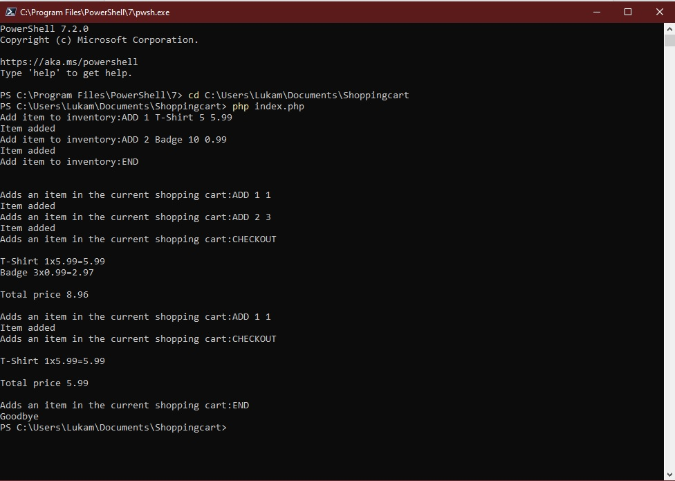

# Shopping cart # 

* `Shopping cart` is simple in-memory, single user command line store.
* `Setup` instructions are made for `Windows` users only.

## Setup ##

1. Download the `Windows` `PHP` environment from this [link](https://windows.php.net/downloads/releases/php-8.0.12-nts-Win32-vs16-x64.zip). 

2. Extract the `.zip` file to  preferred location. It is recommended to choose the Boot Drive(C Drive) inside a folder named PHP (i.e. `C:\php`).

3. Add the folder (`C:\php`) to the `Environment Variable Path` so that it becomes accessible from the command line.  To do so:  
> * Right click on My Computer 
> * Select `Properties` from the context menu
> * Click the `Advanced system settings` 
> * Click `Environment Variables`
> * In the section `System Variables`, select  `PATH` under ` environment variable` , and press `Edit` 
> * Specify the value of the `PATH`  environment variable (`C:\php`  or the location of extracted php files). 
> * Close all remaining windows by clicking OK.

4. After installation of PHP, run the code in the command line. Follow the steps below: 
 
> * Open terminal or command line window.
> * Navigate to the folder where PHP files are present.
> * Run the following command:

```cmd
php file_name.php
``` 
## Usage ##

* The application consists of 2 phases.
* * First phase: Adding new goods to the inventory
* * Second phase: Adding new goods to the shopping cart


Below are the commands for each phase.

### Commands for adding items to the inventory  ### 

* First phase:

> * `ADD` - Adds items to the inventory 
> * `END` - Ends the inventory adding stage
 

* Second phase:

> * `ADD` - Adds an item in the current shopping cart
> * `REMOVE` - Removes item from the shopping cart
> * `CHECKOUT` - Print total price,quantity and all items
> * `END` - Closes the stage and exits the program


## Example ##
```
* Add item to inventory: ADD 1 T-Shirt 5 5.99
* Item added
* Add item to inventory: ADD 2 Badge 10 0.99
* Item added
* Add item to inventory: END
* Adds an item in the current shopping cart: ADD 1 1
* Item added
* Adds an item in the current shopping cart: ADD 2 3
* Item added
* Adds an item in the current shopping cart: CHECKOUT

* T-Shirt 1x5.99=5.99
* Badge 3x0.99=2.97

* Total price 8.96
```

## Assests ##

